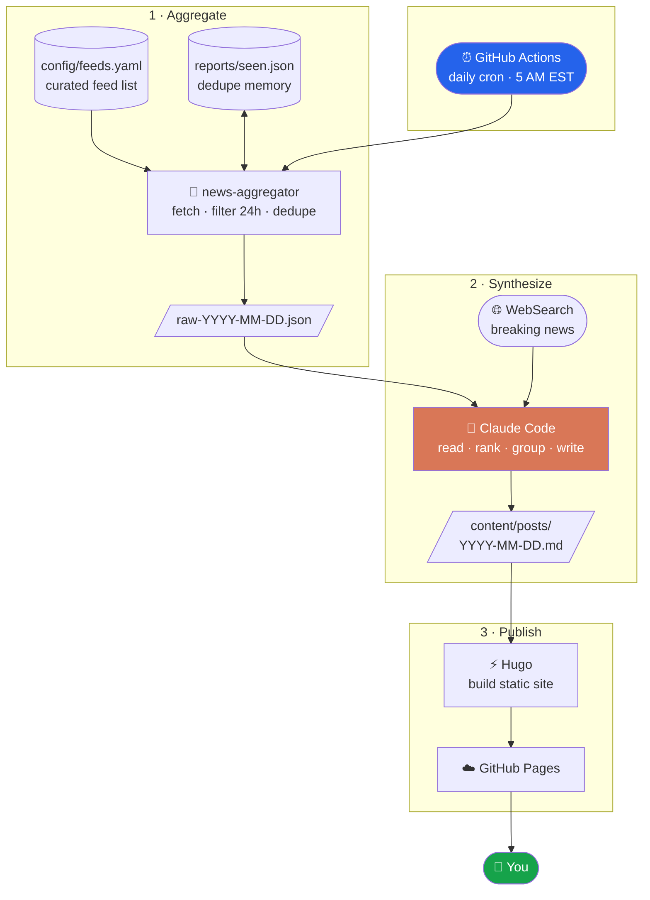

This site is fully automated. No one writes the digests by hand — every morning a
GitHub Actions workflow runs the whole pipeline end to end, from fetching raw feed
data to publishing the finished site. Here's the full picture.

## Architecture

## Step by step

### 1 · Aggregate

A small Python tool (`news-aggregator`) reads the feed list from
[`config/feeds.yaml`](/sources/), fetches every feed, and keeps only entries from
the **last 24 hours**. It tracks every URL it has already seen in `seen.json`, so
the same story never shows up twice across days. The result is a single raw JSON
file of the day's new entries.

### 2 · Synthesize

[Claude Code](https://www.claude.com/product/claude-code) reads that raw JSON and
does the editorial work: it skips marketing fluff and minor patch notes, groups
articles that cover the same story, picks the day's top story, sorts everything
into themed categories, and assigns each item a relevance tier. It also runs a
**web search** to catch breaking news the RSS feeds may have missed. The output is
one Markdown post with front matter — the same format you're reading now.

### 3 · Publish

[Hugo](https://gohugo.io) builds the Markdown into this static site — archive,
navigation, RSS feed, and all — and the workflow deploys it to **GitHub Pages**.
Posts older than 60 days are pruned automatically to keep things current.

## The whole thing is open source

Feed config, aggregator, Claude instructions, and site templates all live in one
repo. Browse it, fork it, or suggest a feed on
[GitHub](https://github.com/dmorand17/news-aggregator).
